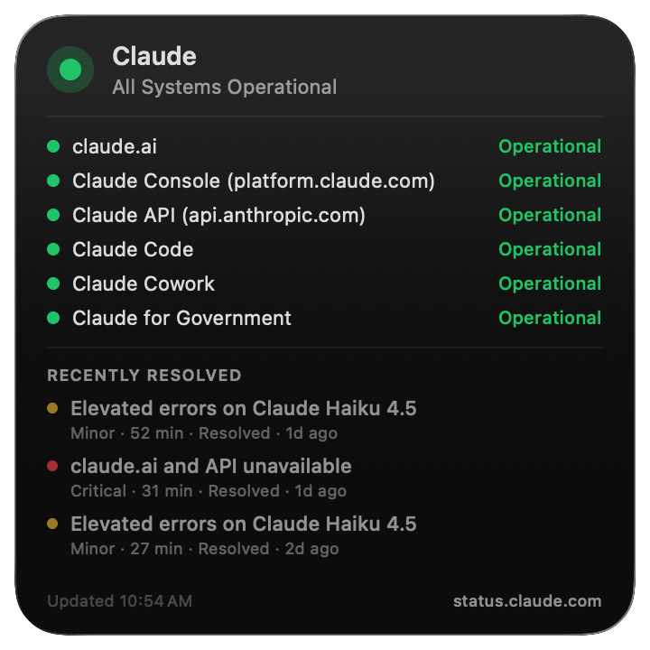

# Claude Status Widget

A macOS desktop widget that shows live status from [status.claude.com](https://status.claude.com): component health, recent incidents (with duration), and a 24-hour severity ring on the header dot when something major happened recently.



## Install

The app is signed with an Apple Developer ID and notarized by Apple, so macOS accepts it without security warnings.

1. Download **[ClaudeStatus.app.zip](https://github.com/keithters/claudestatus/releases/latest/download/ClaudeStatus.app.zip)**.
2. Unzip and drag `ClaudeStatus.app` into your **Applications** folder.
3. Open it once (a small confirmation window appears — you can close it).
4. **Right-click your desktop → Edit Widgets**, search "Claude", and drag a size onto the desktop.

Or, one line in Terminal:

```sh
curl -L https://github.com/keithters/claudestatus/releases/latest/download/ClaudeStatus.app.zip -o /tmp/cs.zip && \
ditto -x -k /tmp/cs.zip /Applications/ && \
open /Applications/ClaudeStatus.app
```

## Build from source

Requires full Xcode and [XcodeGen](https://github.com/yonaskolb/XcodeGen):

```sh
brew install xcodegen
./build.sh
cp -R build/Build/Products/Release/ClaudeStatus.app /Applications/
open /Applications/ClaudeStatus.app
```

## Layout

- `App/` — containing macOS app (first-launch view)
- `WidgetExt/` — WidgetKit extension (small / medium / large views)
- `Shared/` — models, palette, async fetcher
- `Project.yml` — XcodeGen spec; `.xcodeproj` is regenerated from this
